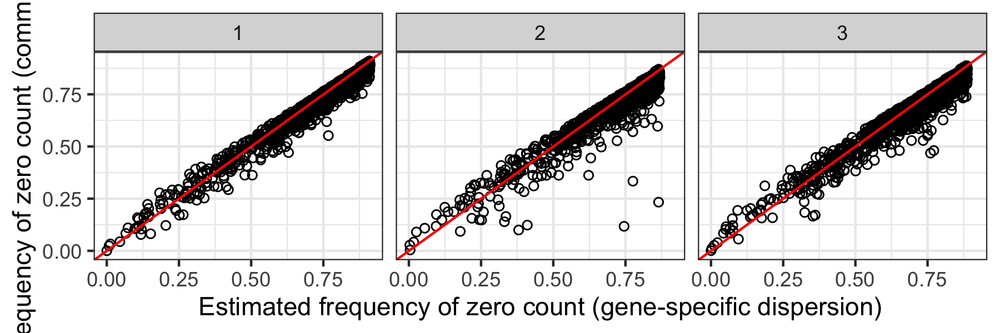

`PhitestR` currently supports input of a UMI count matrix with cluster labels.


To demonstrate the usage of `PhitestR` with a count matrix, we use an example dataset which can be downloaded from this [link](https://rutgers.box.com/s/piwjqda7vh5pno3sqzv0hyomk1mbapwq). To use PhitestR, we need a count matrix (in this example, `object`) with rows representing genes and columns representing cells. In addition, we also need a (character or numeric) vector of labels (in this case, `label`) specifying the assignments of the cells.
```{r eval = FALSE}
data = readRDS("Example.rds")
object = data$count
label = data$labels
```
Now, to run Phitest, we just need to specify the count matrix, cluster labels, and the number of cores to be used in parallel computation. The result is a list containing two elements. The first element is a vector of P values corresponding to the clusters in `label`. 
```{r eval = FALSE}
result = phitest(object, label, ncores = 2)
result$pval
```
The second element is a named list of estimated parameters corresponding to the clusters. The list names are the cluster labels, and each element is a matrix with rows representing genes and columns representing estimated parameters. 


For example, we could make similar plots as shown in the paper with the code below:
```{r eval = FALSE}
library(ggplot2)
labels = names(result$par)
par = lapply(labels, function(l){
  tp = result$par[[l]]
  tp$cluster = l
  return(tp)
})
par = Reduce(rbind, par)
ggplot(par, aes(x = dhat, y = dhat.c)) +
  geom_point(shape = 1, cex = .5) +
  geom_abline(intercept = 0, slope = 1, color = "red") +
  facet_wrap(~cluster) +
  xlab("Estimated frequency of zero count (gene-specific dispersion)") +
  ylab("Estimated frequency of zero count (common dispersion)")
```

{width=100%}
